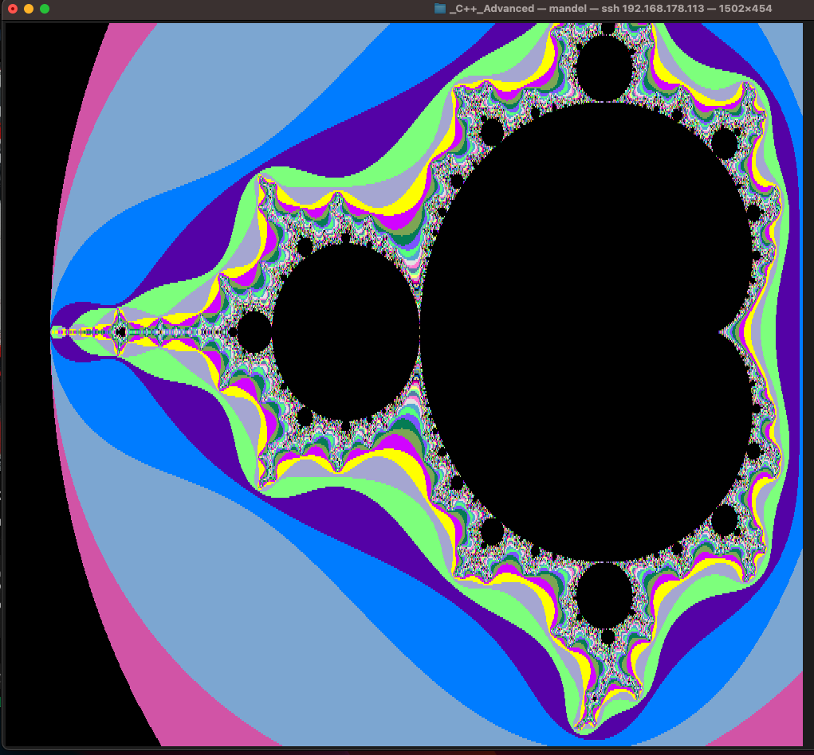
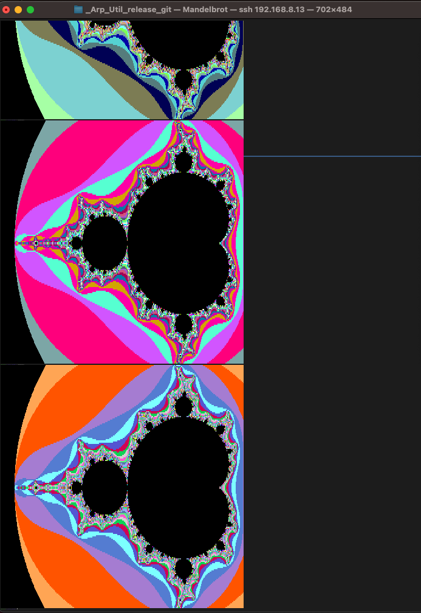
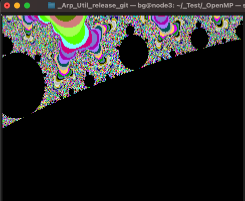

Introduction:
=============

This command line program draw Mandelbrot set on textual terminals supporting 256 colours mode (i.e. xterm-256color). It requires that the font in use is set to its minimum size.
It's an evolution of my previous program, mandelbrot256, using GPU massive parallelism accessed via CUDA suite.



The palette is randomised before the draw, so the set appear differently at every run:



You can also zoom in and / or move the center to draw personalised pictures:



Testing:
=========

Tested on:
* An i7 pc (program), Ubuntu 22.04.4 LTS, nvcc version V12.4.99, CUDA 12.4
* MacOs 13.6.4 with xterm-256color (terminal);

Dependencies:
=============

* CUDA 12.4 or compatible
* See NVidia documentation for installation instructions.

Installation and Use:
=====================

- compile the program as follow :
```shell
  make clean all
```

- Reduce one terminal font size at minimum and cut and paste the command from something permitting a comfortable reading;

- Use program's help option to have information about required parameters:
```shell
$ ./mandelbrot -H
./mandelbrot [-h <height>] [-w <width>] [-m <iterations>] | [-H]

 -m  <iterations>  number of iterations
 -w  <width>       specifies image width
 -h  <height>      specifies image height
 -z  <factor>      specifies zooming factor
 -u  <units>       move center up
 -d  <units>       move center down
 -l  <units>       move center left
 -r  <units>       move center rigth
 -b  <units>       Cuda blocks
 -H                print this synopsis
```

- Default demo:
```shell
./mandelbrot
```

- Draw a picture with specific dimensions:
```shell
./mandelbrot -h 100 -w 100 
```

- You can zoom in using -z , using, if necessary, -u, -d, -r or -l to move the center:
```shell
./mandelbrot -h 100 -w 100 -z 5 -u 5 -r 5
```
